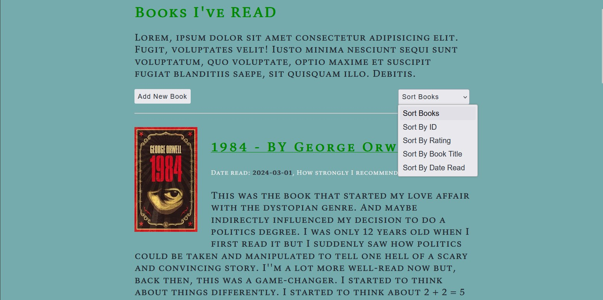

# Personal Books Management System

This is a simple Library Management System built using Node.js, Express.js, EJS, and PostgreSQL. It allows users to add, edit, delete, and view books in 
his library; This project is a web application that allows users to manage their personal books collection, keep up with their own personal books, reviews and notes.

## Table of Contents

* [Getting Started](#getting-started)
* [Features](#features)
* [Tech Stack](#tech-stack)
* [Installation](#installation)
* [Dependancies](#Dependancies)
* [Project Preview](#Project-Preview)
* [Acknowledgments](#Acknowledgments)

## Getting Started

These instructions will get you a copy of the project up and running on your local machine for development and testing purposes:

1. Clone this repository to your local machine.
2. Create a new PostgreSQL database and update the .env file with the correctcredentials.
3. Run npm install to install the necessary dependencies.
4. Run npm start to start the application.
5. Open your web browser and navigate to http://localhost:3000 to view the todo list.

## Features

* Add new books to the library
* Edit existing books in the library
* Delete books from the library
* View books in the library

## Tech Stack

* Node.js
* Express.js
* PostgreSQL
* EJS
* Sass
* Axios
* Body-parser
* Dotenv

## Installation
1. Clone the repository

```bash
git clone https://github.com/username/library-management-system.git
```

2. Install the dependencies

```bash
npm install
```

3. Create a .env file and add the following variables

```makefile
DB_USER=<username>
DB_HOST=<host>
DB_PORT=<port>
DB_DATABASE=<database>
DB_PASSWORD=<password>
API_URL=<api_url>
```
4. Run the application
```bash
npm start
```

## Dependancies
* Express: A minimal and flexible Node.js web application framework.
* EJS: Embedded JavaScript templates for rendering dynamic content.
* Body-parser: Middleware for parsing incoming request bodies.
* Axios: a simple promise based HTTP client for the browser and node.js.
* Postgresql: open source object-relational database system that has earned it a strong reputation for reliability, feature robustness, and performance. 
* Dotenv: Loads environment variables from a .env file into process.env.

## Project Preview


----

----

----

----

----


## Acknowledgments

Special thanks for the creators of Open Library Covers API [Open Library Covers API](https://openlibrary.org/dev/docs/api/covers).

Special thanks to the original author, [amrmabdelazeem](https://github.com/amrmabdelazeem/) , for creating this project.
